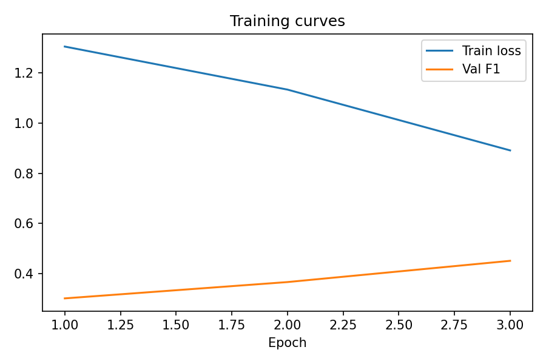
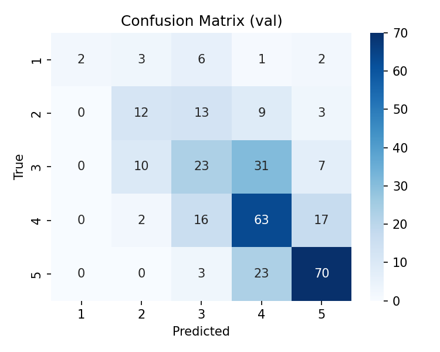
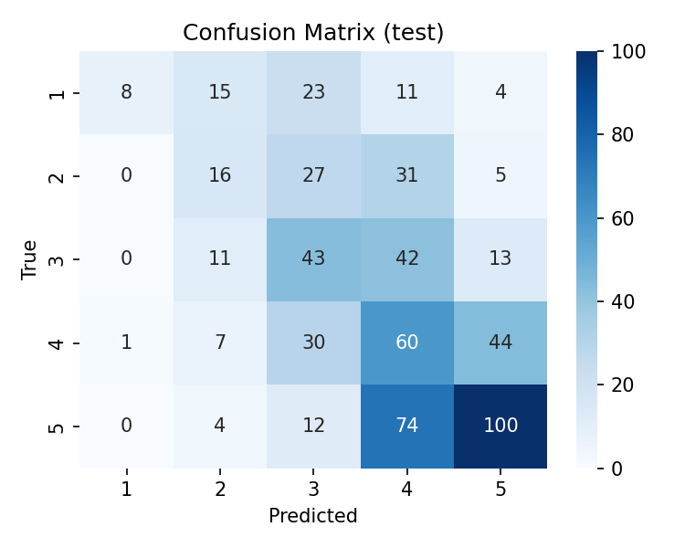

# Legal Text Decoder

End-to-end pipeline for readability classification (labels 1–5) on Hungarian ÁSZF texts. Containerized, reproducible, with baseline + transformer models, evaluation, inference, plots, and logs.

## Project Information
- **Topic**: Legal Text Decoder  
- **Student Name**: _Fill in your name_  
- **Aiming for +1 Mark**: No

## What the Pipeline Does
1. **Data prep** (`src/01-data-preprocessing.py`): download zip, extract, parse Label Studio JSONs, filter too-short/empty texts, build fixed train/test split by Neptun, write `data/final/train.csv` and `data/final/test.csv` (columns: `text,label`).
2. **Baseline** (`src/01_1-baseline.py`): TF‑IDF (1–2 gram) + Logistic Regression with class weights, hold-out val from train, metrics logged, model saved to `data/model.joblib`.
3. **Transformer** (`src/02-training.py`): HuBERT sequence classifier (5 classes), max_len=128, batch=8, 4 epochs, AdamW + linear scheduler, grad clip. Saves best val F1 weights to `data/model.pt`, metrics to `data/model.json`, and training curves to `media/training_curves.png`.
4. **Evaluation** (`src/03-evaluation.py`): reloads weights, runs validation (rebuilt split) and test; logs reports/metrics; saves confusion matrices to `media/confusion_val.png` and `media/confusion_test.png`; metrics to `data/model.eval.json`.
5. **Inference** (`src/04-inference.py`): runs predictions on a fixed set of unseen, labeled samples (and a few from test for structure), logs predicted vs expected, writes `log/inference_outputs.json`.
6. **Notebooks**: quick EDA and label analysis in `notebook/01-data-exploration.ipynb` and `notebook/02-label-analysis.ipynb`.

## Data Preparation
Run inside Docker (with data mount):
```bash
docker run --rm -v "$(pwd)/data":/app/data -v "$(pwd)/log":/app/log dl-project python src/01-data-preprocessing.py
```
Outputs: `data/final/train.csv`, `data/final/test.csv`.

## Build & Full Pipeline Run (one command)
```bash
docker build -t dl-project .
rm -f log/run.log
docker run --rm \
  -v "$(pwd)/data":/app/data \
  -v "$(pwd)/log":/app/log \
  dl-project > log/run.log 2>&1
```
This executes preprocess → baseline → HuBERT train (4 epochs) → eval (val+test) → inference. Logs go to stdout, `log/run.log`, and per-script logs.

## Artefacts & Outputs
- **Models/Metrics**: `data/model.pt`, `data/model.json`, `data/model.eval.json`, `data/model.joblib`
- **Splits**: `data/final/train.csv`, `data/final/test.csv`
- **Logs**: `log/run.log`, `log/preprocess.log`, `log/baseline.log`, `log/training.log`, `log/eval.log`, `log/inference.log`
- **Plots**: `media/training_curves.png`, `media/confusion_val.png`, `media/confusion_test.png`
- **Inference results**: `log/inference_outputs.json`
- **Notebooks**: `notebook/01-data-exploration.ipynb`, `notebook/02-label-analysis.ipynb`

### Plot preview (files will be generated after a full run)




## File Structure
- `src/`
  - `01-data-preprocessing.py` — download/extract, JSON normalize, filter, train/test CSV
  - `01_1-baseline.py` — TF‑IDF + Logistic Regression baseline
  - `02-training.py` — HuBERT fine-tuning, metrics, training curves
  - `03-evaluation.py` — val+test metrics, confusion matrices
  - `04-inference.py` — fixed sample inference with expected labels
  - `config.py` — hyperparameters and paths
  - `utils.py` — logging (stdout + run log + per-script log)
- `notebook/` — EDA and label analysis
- `media/` — saved plots (training curves, confusion matrices)
- `data/` — splits and model artefacts (after running)
- `log/` — consolidated and per-script logs
- `Dockerfile`, `requirements.txt`, `run.sh`, `README.md`

## Logging Checklist
- Hyperparameters, data loading confirmation, model param counts
- Training progress (loss, val metrics per epoch)
- Validation metrics and confusion matrix
- Test metrics and confusion matrix
- Inference results (pred vs expected on fixed samples)
All captured in `log/run.log` when running the full pipeline as above.
